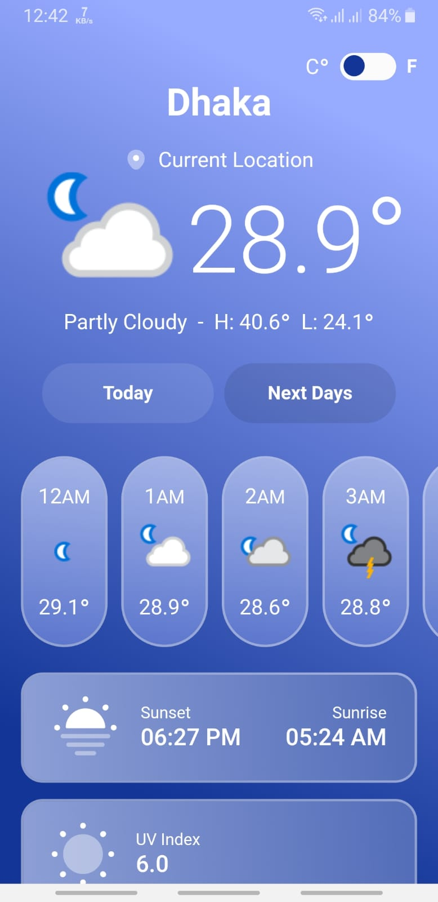
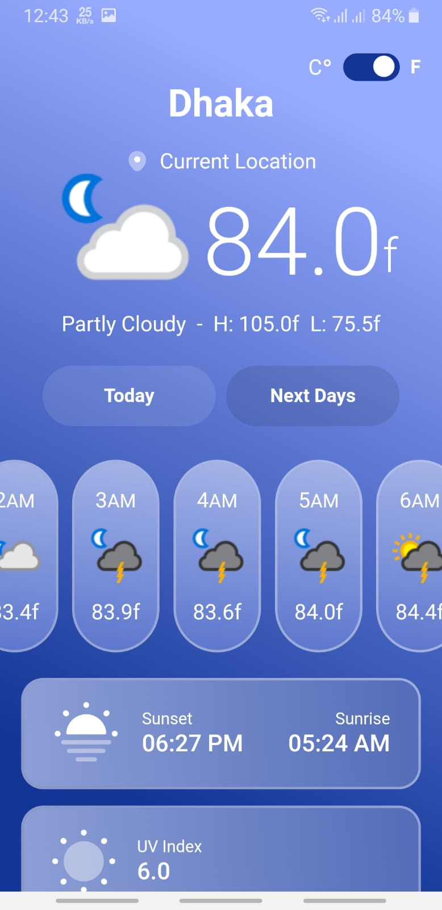

# Weather-App

## Project Owner
This project is owned and maintained by [SM Mozammal Hossain Imon](https://www.linkedin.com/in/s-m-mozammal-hossain-imon-89aa06197/)

## Description
Experience Weather Application, designed as an assessment project for Steadfast Company Limited. It displays weather data according to user queries. Thoughtfully designed using the robust FF(Feature-First) Architecture. This app sets new standards for a seamless user experience, offering an impressive range of features.

## Key Features
- **FF Architecture with Bloc:** Utilizing Feature First (FF) architecture combined with the "Bloc" package for optimal state management, ensuring smooth data flow and clear separation of concerns. This architecture streamlines code organization, making it easier to maintain and expand the project over time, reducing technical debt and enhancing developer productivity.

- **Clean Code with Detailed Comments:** Our codebase boasts clean and well-organized code, complemented by detailed comments for enhanced readability and maintainability, streamlining the development process.

- **API Handling with Dio:** The app efficiently manages API requests and responses using the Dio package, ensuring uninterrupted access to a vast collection of movies.

- **Effective API Response Management:** With meticulous management of diverse API response status codes, we guarantee uninterrupted communication with our backend.

- **Model Classes for Data Management:** Harnessing model classes, we optimize data storage and circulation, delivering a seamless user experience.

- **Modern UI Effects:** Enjoy the elegance of frosted glass UI, custom clipper, and gradient effects that elevate the app's visual appeal.

- **Local Storage for Personalization:** With local storage capabilities, the app tailors user preferences and data, ensuring a personalized and seamless journey across sessions.

- **Effortless Navigation with Named Routes and Sliding Transitions:** Seamlessly move through the app with named routes and mesmerizing sliding transitions, enhancing navigation.

- **Dependency Injection with GetIt:** Leveraging GetIt for dependency injection simplifies the management of dependencies, promoting modularity and testability in the codebase, improving code maintainability and scalability.

## Screenshots

| Home 1 (Celsius) | Home 2 (Celsius) | Home 3 (Fahrenheit) | Home 4 (Fahrenheit) |
| :-------------: | :-------------: | :---: | :---------------------: |
|  |  |  |  |

| Home 5 (Celsius) | Home 6 (Fahrenheit) | Home 7 (Fahrenheit) |
| :-------------: | :-------------: | :---: |
|  |  |  | 

## Video
https://github.com/user-attachments/assets/810a54d3-037b-4efc-bb28-d5f2844273e5

## OS Support
At present, we officially aim to support the last two versions of the following operating systems:

[](https://www.creative-tim.com/product/now-ui-pro-react-native)[](https://www.creative-tim.com/product/now-ui-pro-react-native)

## Installation
1. Clone the repository:

   ```bash
   git clone https://github.com/sm-mozammal/Weather-App-.git
   
2. Install dependencies:
   ```bash
   flutter pub get
   
3. Set Up Flutter gen
   ```bash
   dart run build_runner build
   
4. Run the app:
   ```bash
   flutter run

## Contributing
Contributions are welcome! If you have any suggestions, bug reports, or feature requests, please open an issue or submit a pull request.
